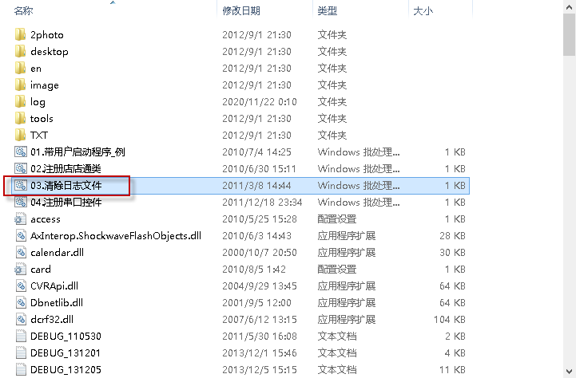
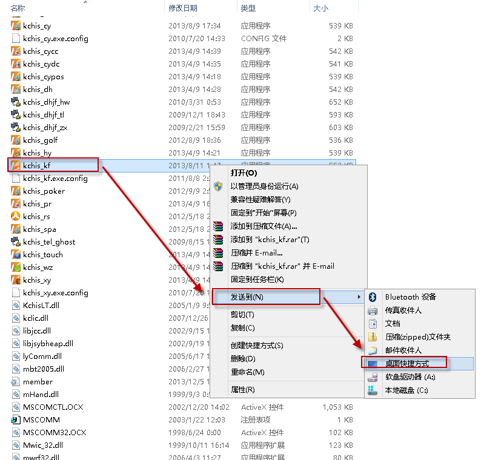

# 如何安装一台新工作站

本软件为绿色软件，复制就可以使用。因为每个酒店都有定制化内容，因此不建议采用安装程序进行安装。

***具体操作步骤如下：***

1. 准备一个移动盘;

2. 进入金柜软件目录（缺省为：D:\kchis_run），中打开。

  
3. 将金柜软件目录复制到移动盘，再重移动盘复制到新电脑的D盘；
4. 在新电脑的金柜软件目录下按下图操作；

  
4. 在桌面打开系统，系统会提示“本电脑没有操作系统权限”;
5. 设置客户端权限，请参考[本机器没有本系统权限](本机器没有本系统权限.md)
