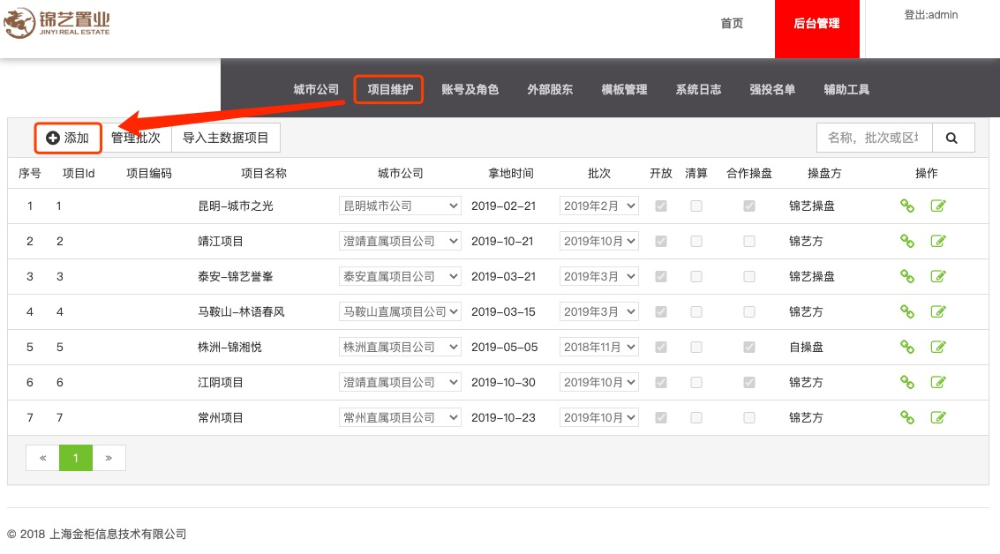
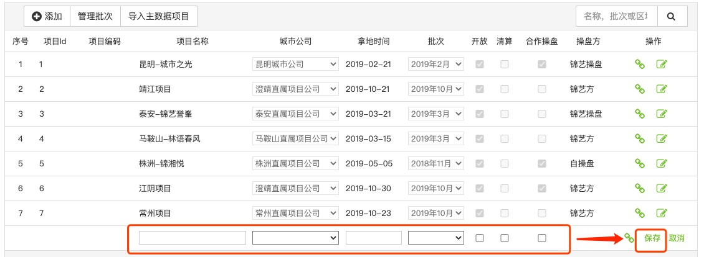
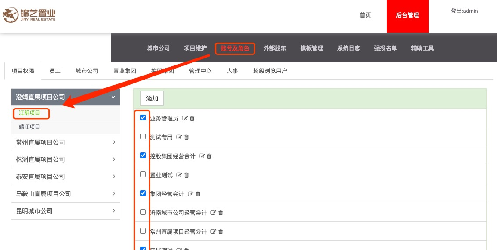

# 项目开通

## 新建项目

使用**【系统管理员(admin)】**登录

打开【后台管理】/【项目维护】

【新建】项目，并输入相关项目信息，【保存】。

* "开放"表示是否生效.
* "预留"项目.
* "城市公司"在【城市公司】项目中管理.
* "批次"在【管理批次】中管理.

## 分配权限

为新建的项目分配管理权限。打开【账号及角色】，选中要分配权限的项目后，在右侧选中有管理权限的用户。

* 注意要分别的不用角色分别选择用户. 
