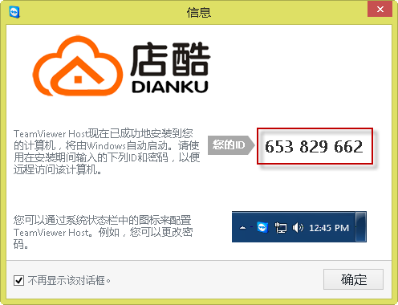
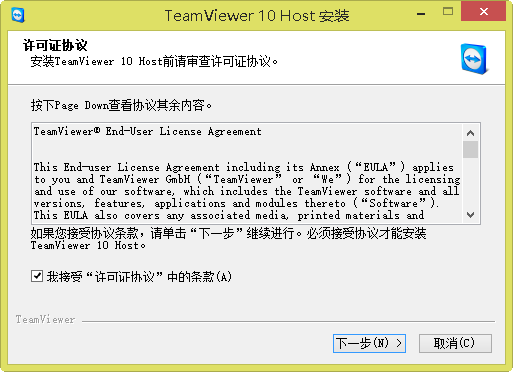
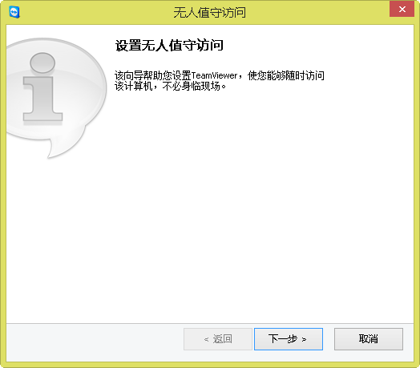
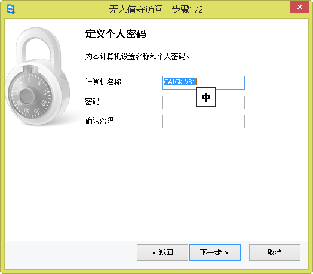
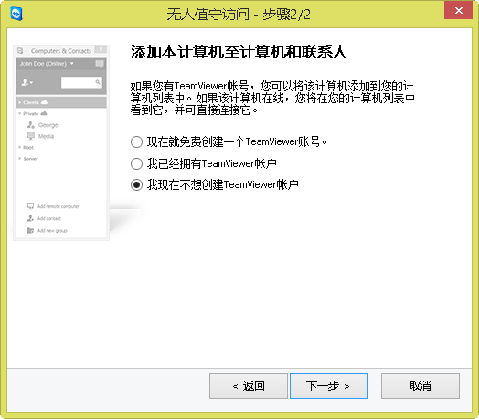

# 如何远程服务?

## 方式一：通过QQ进行远程

* 安装最新版的QQ
* 添加QQ1216398420
* 请先电话联系沟通后，在会话中发起远程

## 方式二：通过远程工具进行远程

安装如下远程工具之一：

* teamviewer:[https://www.teamviewer.com](https://www.teamviewer.com) 安装个人免费版
* todesk: [https://www.todesk.com/](https://www.todesk.com/)  安装个人免费版
* 向日葵：[https://sunlogin.oray.com/](https://sunlogin.oray.com/) 安装个人免费版

打开远程工具，将ID和密码发给我

## 方式三：金柜老客户

### 远程工具teamviewer,请先查看是否已经安装。如果没有安装请先下载安装。[下载](ref://assets/TeamViewer_Host_Setup.zip)

* 打开远程软件teamviewer
* 通知客服您的ID

  

### 安装远程工具步骤

1. 下载安装包：[下载](ref://assets/TeamViewer_Host_Setup.zip)
2. 开始安装

  
  
  
  
  
  
